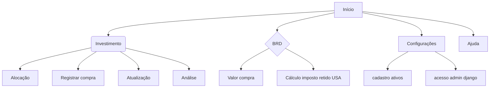

## Início do sistema

# área pública

# área interna

```mermaid
    flowchart TD
        1[Início] --> 2(Investimento)
            2 --> 2.1[Alocação]
            2 --> 2.2[Registrar compra]
            2 --> 2.3[Atualização]
            2 --> 2.4[Análise]
        1 --> 3{BRD}
            3 --> 3.1[Valor compra]
            3 --> 3.2[Cálculo imposto retido USA]
        1 --> 4[Configurações]
            4 --> 4.1[cadastro ativos]
            4 --> 4.2[acesso admin django]
        1 --> 5[Ajuda]
```

Módulos:
* [AUTOTITLE](/docs/modulo_atualizacao.md)
* [AUTOTITLE](/docs/modulo_operacoes.md)