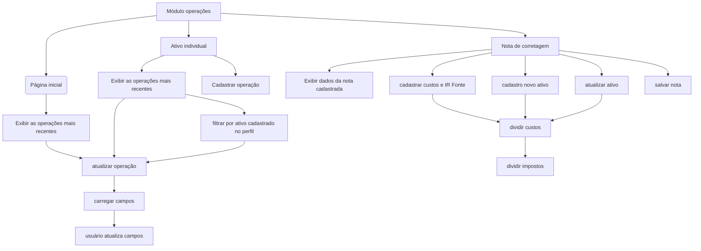

# Módulo operações

```mermaid
flowchart TD
    1[Módulo operações] --> 2(Página inicial)
        2 --> 2.1[Exibir as operações mais recentes]
            2.1 --> 3.1.1[atualizar operação]
    1 --> 3[Ativo individual]
        3 --> 3.0[Exibir as operações mais recentes]
            3.0 --> 3.1.1[atualizar operação]
        3.0 --> 3.1[filtrar por ativo cadastrado no perfil]
            3.1 --> 3.1.1[atualizar operação]
                 3.1.1 --> 3.1.2[carregar campos]
                 3.1.2 --> 3.1.3[usuário atualiza campos]

        3 --> 3.2[Cadastrar operação]
    1 --> 4[Nota de corretagem]
        4 --> 4.0[Exibir dados da nota cadastrada]
        4 --> 4.1[cadastrar custos e IR Fonte]
            4.1 --> 4.2.1[dividir custos]
        4 --> 4.2[cadastro novo ativo]
            4.2 --> 4.2.1[dividir custos]
            4.2.1 --> 4.2.2[dividir impostos]
        4 --> 4.3[atualizar ativo]
            4.3 --> 4.2.1[dividir custos]
        4 --> 4.4[salvar nota]
```