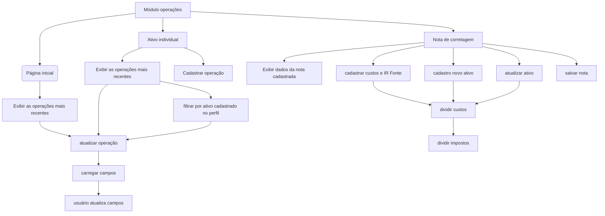

# Módulo operações

É neste módulo que ocorre o cadastro das operações de compra, venda, subscrições, etc. 

## Cadastrar ativo individual listado em bolsa
É possível alterar qualquer ativo listado em bolsa, sendo possível corrigir algum lançamento individual da nota de corretagem, mas principalmente é o caminho para cadastrar operações que não geram nota de corretagem, como subscrições e desdobramentos. 

## Cadastrar ativo individual não listado em bolsa (fundos)
Obter a quantidade de cotas envolvidas em cada operação com fundos é um desafio, pois no momento da compra essa informação não é divulgada e muitas corretoras não exibem o valor de cotas relacionado a cada movimentação. E tem corretora que sequer informa a quantidade de cotas.

O único extrato que já chegou em minhas mãos que indica a quantidade de cotas em cada movimentação é do BTG(Empiricus). Mesmo assim, os critérios para a dedução do come-cotas (antecipação do Imposto de Renda Retido na Fonte) variam conforme a corretora, algumas preferem alterar a quantidade de cotas, o que dificulta para programar um sistema.

Dessa forma, a solução encontrada é franquear ao usuário utilizar as cotas do fundo ou as do sistema. 

Se o usuário informar o valor total da operação (compra, venda, etc), o sistema automaticamente calculará a quantidade de cotas da operação.

Se o usuário preferir informar o valor da cota e quantidade de cotas, o sistema considerará esses valores para o cálculo.

### Edição dos ativos individuais
A funcionalidade acima está disponível somente ao cadastrar novas operações de compra e venda. Na necessidade de alterar a linha lançada, a cota e seu valor correspondente devem ser alteradas manualmente.

## Cadastrar nota de corretagem
É a forma ideal para cadastrar operações em bolsa que geraram nota de corretagem, pois o sistema distribui automaticamente os custos proporcionalmente ao custo dos ativos adquiridos, bem como distribui o IRRF pelos ativos. 

No caso do IRRF, talvez seja necessário adotar outra prática no futuro, a se analisada quando do desenvolvimento do módulo que calculará a Imposto de Renda sobre as operações.
